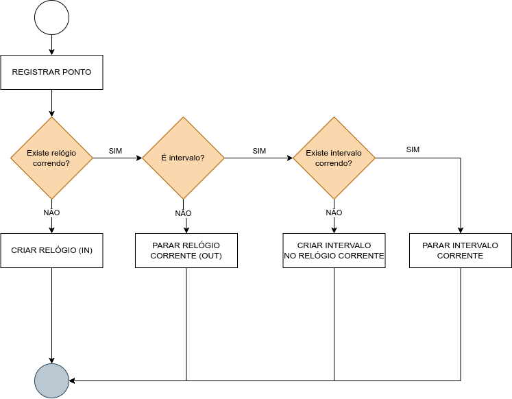

# Nome do Microsserviço

Uma breve descrição sobre a funcionalide do Microsserviço.



## Instruções para rodar a aplicação

```
digite aqui
```

## Justificativa do Padrão SAGA escolhido

Por ser um cenário de uma saga simples, com poucas operações, realizamos a escolha da **saga coreografada** para o nosso projeto.
A coreografia permite que cada serviço adapte sua parte da transação com base nos eventos que ocorrem em tempo real. Isso permite uma maior flexibilidade para lidar com casos de uso complexos e cenários de exceção. Os serviços permanecem desacoplados e independentes uns dos outros. Eles não precisam se comunicar diretamente para coordenar a transação, o que reduz a complexidade e facilita a manutenção e escalabilidade do sistema. Como cada serviço pode operar de forma independente, é mais fácil escalar partes específicas do sistema conforme necessário, sem afetar outras partes. Em resumo, o padrão SAGA coreografada oferece uma abordagem mais flexível e distribuída para coordenar transações em um ambiente de microserviços e mensageria, mantendo os serviços desacoplados e independentes uns dos outros. Isso resulta em sistemas mais escaláveis, resilientes e flexíveis.A coreografia permite que cada serviço adapte sua parte da transação com base nos eventos que ocorrem em tempo real. Isso permite uma maior flexibilidade para lidar com casos de uso complexos e cenários de exceção. Os serviços permanecem desacoplados e independentes uns dos outros. Eles não precisam se comunicar diretamente para coordenar a transação, o que reduz a complexidade e facilita a manutenção e escalabilidade do sistema. Como cada serviço pode operar de forma independente, é mais fácil escalar partes específicas do sistema conforme necessário, sem afetar outras partes. Em resumo, o padrão SAGA coreografada oferece uma abordagem mais flexível e distribuída para coordenar transações em um ambiente de microserviços e mensageria, mantendo os serviços desacoplados e independentes uns dos outros. Isso resulta em sistemas mais escaláveis, resilientes e flexíveis.

## Links com os relatórios dos processamentos do OWASP ZAP (antes e após a correção)

- [Relatórios](https://drive.google.com/drive/folders/1v-zCWdVGAg8d6_QTHEeZjFVCxI5eCrzO?usp=sharing)

## Link com o relatório RIPD do sistema

- [RIPD](https://drive.google.com/file/d/1QwHcXojaKHjKTMpnIp0xWjB1zfmLlcNg/view?usp=sharing)

## Link para o desenho da arquitetura

- [Desenho da arquitetura](https://drive.google.com/file/d/1NQ8dryi6pV_g6jYlQqqKA2JAvkYT4xku/view?usp=sharing)

## Link para o video

- Projeto rodando, inclusive com o padrão SAGA funcionando;
- Explicação do padrão SAGA escolhido e sua justificativa;
- Arquitetura da estrutura da nuvem e como a comunicação SAGA está montada.
- [Apresentação do cluster,infra estrutra e chamada das rotinas pelas APIs na AWS:](https://youtu.be/8MXB1xWqfrE)
- [Apresentação da aplicação:](https://drive.google.com/drive/folders/1yGdvC0Sts3Vi8ygJf4vMCwODX5S0RhRF?usp=sharing)
